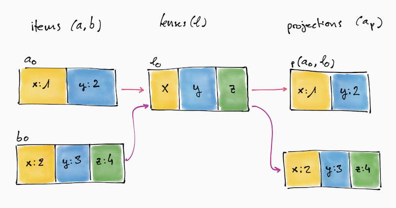
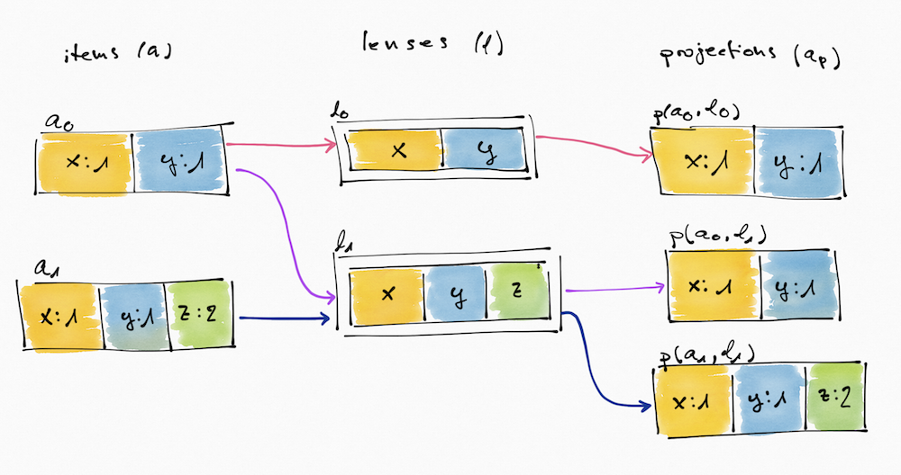
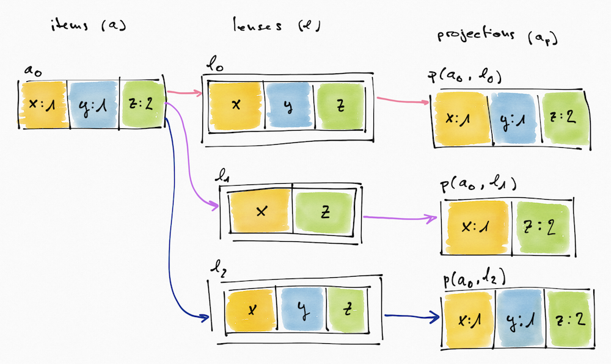

---
rfc:
start_date: 2017-11-17
status: draft
---

# Schema Evolution: Field operations

## Summary

This RFC proposes a way to add and subtract fields from a Register, and
defines the meaning of these operations. Thus, it doesn’t attempt to cover
other field operations such as field transformation (e.g. change the datatype
of a field).

Note that you can find the [glossary](#glossary) of concepts used throughout
this RFC at the end of it.

Note: The pseudocode in this RFC resembles [Elm](http://elm-lang.org) but it
is not intended to be valid.


## Motivation

Currently, the Registers Data Model has no way to evolve the data structure
described in the schema and used in data items. This means a Register has to
be designed upfront with the right fields forever given it is an append-only
log. We need a way to be able to evolve the schema definition and a way to
reflect such evolution on existing and new data.


## Explanation

This section covers both [field addition](#field-addition) and [field
subtraction](#field-subtraction). In order to define the latter, we need to
introduce a new concept into the Registers world: Lenses.


### <span id="schemas-and-lenses">Schemas and lenses</span>

A lens is a subset of fields defined in the schema informing what parts of an
item should be shown in a record and potentially help enforcing strict
validation while adding new data. But, why do we need a new concept? Aren't
schemas enough?

In short, no. The schema describes all possible fields for an item in a
Register regardless of when it was added. If we allow the removal of a field
at the schema level, then we have to have another mechanism to keep track of
all fields that were valid at some point so we can ensure we don't introduce a
new field that is incompatible with a previous field now gone. If we make
schemas be the historical list of fields, then we need a way to express how do
we want to _see_ the data; it is analogous to SQL views.

To recap, a schema should keep track of any valid field across the log.

A lens should describe which of these fields should be used when handling data
on a particular size of the log.

In a picture:




### <span id="field-addition">Field addition</span>

The addition operation evolves the previous mechanism defined in _the RFC for
Adding a Field_ (TODO: Add a link to the RFC once it's approved) by adding an
operation for adding a field to the lens. Note that although the lens
operation depends on the success of the schema operation they don't have to
happen one immediately after the other.

### Addition of a field to the lens

The addition of a field, [`Lens.add`](#lens-add-function), adds a [field
id](#field-id) to the [lens](#lens).

As a consequence, any projection of an [item](#item) through the lens will
include this new field if and only if it has a value. For this opperation to
succeed, the [schema](#schema) has to have a [field](#field) with the [field
id](#field-id) as described in the [`Lens.validate`](#lens-validate-function)
function.

#### Example: Add field id to the lens

```elm
s_0 = Schema [("x", Number), ("y", Number)]
l_0 = Lens ["x"]
l_1 = Lens.add l_0 "y" s_0 -- Lens ["x", "y"]
```


### <span id="field-subtraction">Field subtraction</span>

As explained in [Schemas and lenses](#schemas-and-lenses) the subtraction
operation only exists for lenses. Once a schema has gained a field it can’t be
removed.

#### Subtraction of a field from a lens

The subtraction of a field, [`Lens.subtract`](#lens-subtract-function) is the
result of removing a [field id](#field-id) from the [lens](#lens). As a
consequence, any [projection](#projection) an existing item through the lens
will not include the field even if the item has a value.

```elm
s_0 = Schema [("x", Number), ("y", Number)]
l_0 = Lens ["x", "y"]
l_1 = Lens.subtract l_0 "y" -- Lens ["x"]
```

### Item projection through a lens

As described in previous sections, items are not changed when adding or
removing fields. They are immutable pieces of data and they are treated as
such. Instead, we define a function [`Lens.project`](#lens-project-function)
to project a view of the data through the lens.

The implications of this are:

* Data doesn't change as a result of a schema or lens operation.
* The [record](#record) item information is the result of projecting the item
  through the lens hence, it is not possible to compute the item hash from a
  record.

#### Example: Item with all fields set

```elm
s_0 = Schema [("x", Number), ("y", Number)]
l_0 = Lens ["x", "y"]
a_0 = Item {x: 1, y: 1}
a_p = Lens.project l_0 a_0 -- Item {x: 1, y: 1}
```

#### Example: Item with some fields set

```elm
s_0 = Schema [("x", Number), ("y", Number)]
l_0 = Lens ["x", "y"]
a_0 = Item {x: 1}
a_p = Lens.project l_0 a_0 -- Item {x: 1}
```

#### Example: Item with all fields set and smaller lens

```elm
s_0 = Schema [("x", Number), ("y", Number)]
l_0 = Lens ["x", "y"]
a_0 = Item {x: 1, y: 1}
l_1 = Lens.subtract l_0 "y" -- Lens ["x"]
a_p = Lens.project l_1 a_0 -- Item {x: 1}
```

#### Example: Complementary operations

```elm
s_0 = Schema [("x", Number), ("y", Number), ("z", Number)]
l_0 = Lens ["x", "y", "z"]
a_0 = Item {x: 1, y: 1, z: 2}
l_1 = Lens.subtract l_0 "y"
a_p = Lens.project l_1 a_0 -- Item {x: 1, z: 2}
l_2 = Lens.add l_0 "y" s_0 -- Lens ["x, "y", "z"]
a_p' = Lens.project l_2 a_0 -- Item {x: 1, y: 1, z: 2}
```

The projection `a_p'` lets us see that **addition** and **subtraction** are
complementary operations.

Two pictures to show some of the examples:






### Item addition

The item addition operation, [`Item.add`](#item-add-function), adds the
projected item if [`Item.validate`](#item-validate-function) succeeds.

Further development could explore the idea of a lens for validation and a lens
for projection (write and read respectively) but it is out of the scope of
this RFC.

The addition of an item steps are:

1. Validate `a` against the current schema `s`: `Item.validate s a`.
    * If the item is invalid, reject the operation.
2. Take the given item `a` and project it against the current lens `l`:
  `a_p = Lens.project a l`.
3. Canonicalise the item `a_p`: `a_c = Item.canonicalise a_p`.
4. Add item `a_c` to the Register.


### REST API Implications

The introduction of lenses affect the serialisation of data in the API. This
section explains the consequences for the [REST API](#rest-api).

#### Item resource

The item resource obtained via `/item/{item-hash}` or `/items` is a
serialisation of an [item](#item) as defined in this RFC.

The consumption of item resources is unaffected by this RFC. Any item hashing
happens against the item, not its current projection.

#### Record resource

The record resource obtained via `/record/{record-key}` or `/records` is a
serialisation of a composite of an entry as described by the specification and
a [projection](#projection) as defined in this RFC. It is important to note
that a record resource should always send the item hash that originated the
projection. It is important because you can’t generate an item hash from a
projection and because you can't generate it either with a non-JSON
serialisation.

A possible solution could be adding the item hash as part of the item
properties:

```json
{
  "ABC": {
    "index-entry-number": "36",
    "entry-number": "36",
    "entry-timestamp": "2017-11-17T16:28:21Z",
    "key": "ABC",
    "item": [{
      "item-hash": "sha-256:6be5cb4d45de8334925425134d90486c636b2ce87a52b5c9cfc6df8ec7b64bd5",
      "local-authority-type": "BGH",
      "website": "https://www.armaghbanbridgecraigavon.gov.uk/",
      "name": "Armagh City, Banbridge and Craigavon Borough Council",
      "start-date": "2015-04-01",
      "local-authority-nir": "ABC"
    }]
  }
}
```

Another consequence for records is the impossibility to [verify a
record](http://openregister.github.io/specification/#ct-verify-record).

TODO: Address the record verification by either removing the idea or reworking
the meaning of a projection.

TODO: If we decide Record proofs need to be kept, we need to seriously assess
the direction the REST API should take: only plumbing access to data or both
plumbing and porcelain. The latter being a ready-to-consume data as intended
by the Custodian. In spirit like git's
https://git-scm.com/book/en/v2/Git-Internals-Plumbing-and-Porcelain


#### Lens resource

The introduction of lenses will require adding a new Lens resource and a
way to get it. E.g. `/lenses`, `/lenses/{id}`.


## <a id="glossary">Glossary</a>

### <a id="datatype">Datatype</a>

Let `DataType` be any of the datatypes defined in the
[specification](http://openregister.github.io/specification/#datatypes). For
brevity, the RFC will express it as a union of strings and numbers.

```elm
type DataType = String | Number
```

### <a id="field-id">Field ID</a>

Let `Id` be any valid field id, [field name in the
specification](http://openregister.github.io/specification/#fieldname-datatype).

```elm
type Id
```

### <a id="field">Field</a>

Let `Field` be a pair of `Id` and `DataType`. Although a Field has more data
than just name and type, for the purpose of this document, we can simplify its
definition.

```elm
type Field = (Id, DataType)
```

### <a id="schema">Schema</a>

Let `Schema` be the set of fields allowed in items. A schema has a required
primary field and optionally a set of fields (unique by `Id`). We will
consider the first field, the primary field.

```elm
type Schema = Schema (Set Field)
```

### <a id="lens">Lens</a>

Let `Lens` be an ordered set of `Id` defined in the schema.

```elm
type Lens = Lens (List Id)
```

### <a id="item">Item</a>

Let `Item` be a data set conforming to the schema.

```elm
type Item = Item (Set (Id, value))
```

Where `value` is any valid value for the corresponding datatype defined in the
schema.

### <a id="entry">Entry</a>

Let `Entry` be a set as defined in the spec.

```elm
type Entry =
  { number : Int
  , timestamp : Timestamp
  , key : Id
  , itemHash : Set Hash
  }
```

### <a id="record">Record</a>

Let `Record` be the composite of an item projection and an entry.

```elm
type Record =
  { number : Int
  , timestamp : Timestamp
  , key : Id
  , item : Set (Hash, Item)
  }
```

### <a id="projection">Projection</a>

A projection is an [`Item`](#item) conforming to a lens. [See
`Lens.project`](#lens-project-function).

### <a id="schema-add-function">Schema `add` function</a>

The function `Schema.add` takes a schema and a field and returns the new
schema.

```elm
Schema.add : Schema -> Field -> Schema
```

If the field already exists the operation behaves like the identity function
so:

```elm
schema' = Schema.add schema field -- schema' == schema
```

### <a id="lens-add-function">Lens `add` function</a>

The function `Lens.add` takes a lens, a field id, and the schema and returns
the resulting lens if it is valid. Otherwise it returns the validation error.

```elm
Lens.add : Lens -> Id -> Schema -> Result LensError Lens
```

If the key doesn't exist in the given schema the operation is invalid.

### <a id="lens-subtract-function">Lens `subtract` function</a>

The function `Lens.subtract` takes a lens and a field id. Returns the lens result
of removing the field id.

```elm
Lens.subtract : Lens -> Id -> Lens
```

### <a id="lens-validate-function">Lens `validate` function</a>

The function `Lens.validate` takes a lens and the schema, if all field ids are
found in the schema, then it is considered a valid lens. Otherwise it returns a
validation error.

```elm
Lens.validate : Lens -> Schema -> Result LensError Lens
```

### <a id="lens-project-function">Lens `project` function</a>

The function `Lens.project` takes a lens and an item and returns an item
conforming to the lens.

```elm
Lens.project : Lens -> Item -> Item
```

### <a id="item-add-function">Item `add` function</a>

The function `Item.add` takes a list of items, a schema, a lens and an item
and returns a new list of items if the given item is valid. Otherwise it
returns a validation error.

```elm
Items.add : (Items, Schema, Lens) -> Item -> Result ItemError Items
```

### <a id="item-validate-function">Item `validate` function</a>

The function `Item.validate` takes a schema and an item and returns the same
item if it is valid. Otherwise it returns a validation error.

```elm
Item.validate : Schema -> Item -> Result ItemError Item
```

## <a id="rest-api">REST API</a>

https://registers-docs.cloudapps.digital/#api-documentation-for-registers
